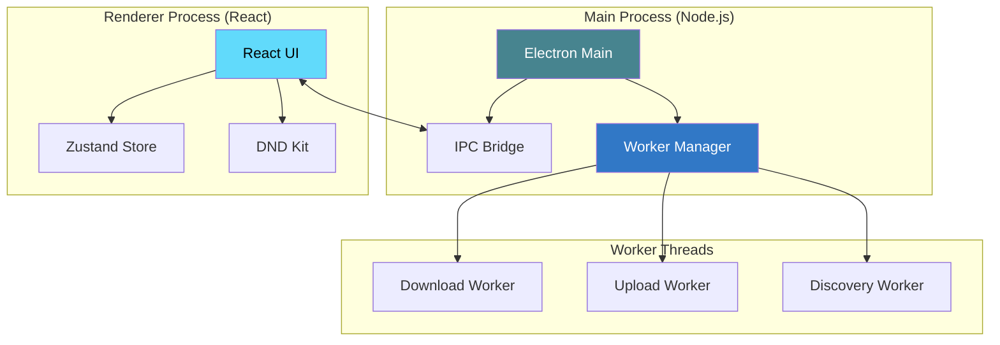

# Prehrajto.cz AutoPilot

<div align="center">

<!-- Badges Row -->
[](https://electronjs.org)
[](https://typescriptlang.org)
[](https://reactjs.org)
[](LICENSE)

[**English**](../README.md) • [**Česky**](../README.cs.md)

<br>

```text
    ____           _                _ _
   |  _ \ _ __ ___| |__  _ __ __ _ (_) |_ ___    ___ ____
   | |_) | '__/ _ \ '_ \| '__/ _` || | __/ _ \  / __|_  /
   |  __/| | |  __/ | | | | | (_| || | || (_) || (__ / /
   |_|   |_|  \___|_| |_|_|  \__,_|/ |\__\___(_) \___/___|
                                 |__/
```

### 🚀 Pokročilá desktopová automatizace pro Prehrajto.cz

**Efektivně spravujte, zpracovávejte a automatizujte svůj video workflow.**

[**Funkce**](#-klíčové-funkce) • [**Architektura**](#-architektura-systému) • [**Technologie**](#-technologický-stack) • [**Instalace**](#-začínáme) • [**Sestavení**](#-produkční-sestavení)

---

</div>

## 📸 Vizuální přehled

<div align="center">

| Objevování videí | Správa fronty |
| :---: | :---: |
|  |  |
| *Procházejte a vybírejte videa ke stažení* | *Přetahování pro změnu pořadí v reálném čase* |

| Průběh stahování | Dashboard Moje videa |
| :---: | :---: |
|  |  |
| *Živá rychlost, ETA a sledování fází* | *Správa vašich nahraných videí* |

</div>

---

<details>
<summary><strong>🚧 Funkce - Rozpracované</strong> (kliknutím rozbalíte)</summary>

### Dokončeno ✓
- [x] Automatické přeskočení zpracovaných videí
- [x] Oprava chyby 401 (dekódování HTML entit)

### Rozpracované 🔄
- [ ] **Paralelní stahování + nahrávání** - Souběžné stahování a nahrávání videí
- [ ] **Přemístění záložky Zpracování** - Kompletně přepracovaný workflow a UX
- [ ] **Přemístění záložky Nastavení** - Lepší organizace a opravy
- [ ] **Uživatelské statistiky** - Sledování historie, využití dat a aktivity
- [ ] **Úprava videí z aplikace** - Měňte názvy a popisy přímo v aplikaci

</details>

---

## 📖 O projektu

**Prehrajto.cz AutoPilot** je sofistikovaná desktopová aplikace navržená pro zjednodušení správy videí pro platformu **Prehrajto.cz**. Postavena na moderním **Electron + React** stacku, nabízí robustní, multiplatformní řešení pro vysoce výkonné objevování videí, automatizované stahování, profesionální vodoznaky a bezproblémové nahrávání.

Navrženo s ohledem na bezpečnost a výkon, aplikace běží zcela lokálně, chrání vaše přihlašovací údaje a využívá worker thready na pozadí pro zajištění plynulého uživatelského rozhraní i při vysoké zátěži.

---

## ✨ Klíčové funkce

### 🔐 Účet a bezpečnost
- **Podpora více účtů**: Spravujte více Prehrajto.cz profilů současně.
- **Bezpečné úložiště**: Šifrované zacházení s přihlašovacími údaji s trvalou správou relací.
- **Automatické přihlášení**: Bezproblémové ověřování na pozadí pomocí obnovy relací přes Playwright.

### ⚡ Inteligentní fronta
- **Intuitivní přetahování**: Snadno prioritizujte úkoly pomocí `@dnd-kit`.
- **Živá telemetrie**: Sledování rychlosti stahování, ETA a procentuálního postupu v reálném čase.
- **Bezpečné operace**: Jedním kliknutím opakujte neúspěšné úkoly a okamžité zrušení.
- **Persistence**: Vaše fronta a postup se automaticky ukládají mezi relacemi.

### 🔍 Automatizované objevování
- **Hluboké skenování**: Automaticky najděte a indexujte videa přímo z Prehrajto.cz.
- **Chytré filtry**: Filtrování obsahu podle délky, velikosti souboru a kvality.
- **Dávkové zpracování**: Vyberte a přidejte stovky videí do fronty jedním kliknutím.

### 🛠️ Vysokovýkonné zpracování
- **Paralelní chunkování**: Spolehlivé stahování po 2MB částech pro maximální rychlost a stabilitu.
- **Profesionální vodoznaky**: Integrovaná podpora FFmpeg pro automatické přidávání log značek.
- **Podpora více engine**: Vyberte si mezi `ffmpeg-chunks`, `curl` nebo `wget` pro optimální spolehlivost.
- **HQ zpracování**: Přepínejte mezi originální kvalitou (HQ) a optimalizovanými přímými streamy.

---

## 🏗️ Architektura systému

Aplikace sleduje moderní multi-procesovou architekturu pro zajištění maximální spolehlivosti a výkonu.



---

## 🛠️ Technologický stack

| Komponent | Technologie | Role |
| :--- | :--- | :--- |
| **Runtime** | **Electron 39.2** | Multiplatformní kontejner |
| **Frontend** | **React 19 + TypeScript** | Moderní, type-safe UI vrstva |
| **Styling** | **TailwindCSS 4** | Utility-first responzivní design |
| **State** | **Zustand** | Výkonná perzistentní správa stavu |
| **Automatizace** | **Playwright** | Zpracování relací na úrovni prohlížeče |
| **Zpracování** | **FFmpeg** | Pokročilá manipulace s videem |
| **Souběžnost** | **Worker Threads** | Neblokující operace na pozadí |

---

## 🚀 Začínáme

### Požadavky
- **Node.js** (doporučena LTS verze)
- **FFmpeg** nainstalován a dostupný v systémové PATH
- **Správce balíčků**: `npm` nebo `pnpm`

### Instalace
```bash
# Klonování repozitáře
git clone https://github.com/nykadamec/preHrajto-AutoPilot.git
cd preHrajto-AutoPilot

# Instalace závislostí
npm install

# Spuštění v režimu vývoje
npm run dev
```

### Konfigurace prostředí
| Nástroj | Účel | Doporučená instalace |
| :--- | :--- | :--- |
| **FFmpeg** | Vodoznaky a zpracování | `brew install ffmpeg` / `choco install ffmpeg` |
| **curl/wget** | Alternativní režimy přenosu | Předinstalováno nebo přes správce balíčků |

---

## 📦 Produkční sestavení

Vygenerujte optimalizované binárky pro vaši platformu:

```bash
# Sestavení pro vaši aktuální OS
npm run build

# Cílené sestavení pro platformy
npm run build:mac   # macOS (Apple Silicon)
npm run build:win   # Windows (x64)
npm run build:linux # Linux
```

Výstupy budou dostupné v adresáři `release/`.

---

## 📄 Licence

Tento projekt je licencován pod **ISC License**. Více informací naleznete v souboru [LICENSE](LICENSE).

---

## 📋 Seznam změn

### [v0.1.4] - 2026-01-21

#### ✨ Nové funkce
- **Automatické přeskočení zpracovaných videí**: Discovery nyní automaticky přeskakuje již zpracovaná videa a pokračuje na další stránky
- **Zjednodušené UI**: Sekce "Již zpracovaná" byla odstraněna - zpracovaná videa se nyní filtrují během discovery

#### 🐛 Opravy chyb
- **Oprava chyby 401**: Vyřešeny selhání stahování videí způsobené nesprávně dekódovanými URL (HTML entity jako `&amp;` jsou nyní správně převedeny na `&`)

---

<div align="center>

**Vytvořeno s ❤️ pro komunitu Prehrajto.cz**

</div>
