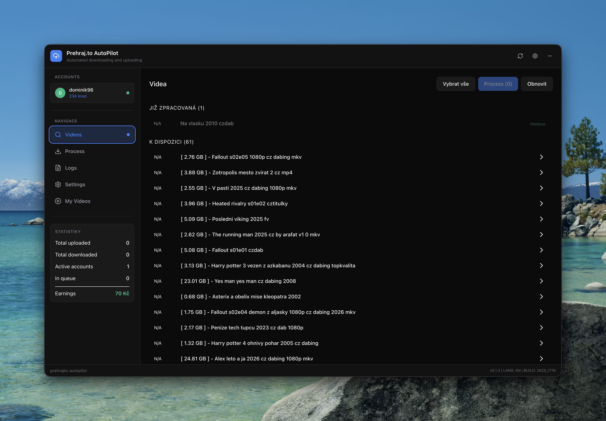
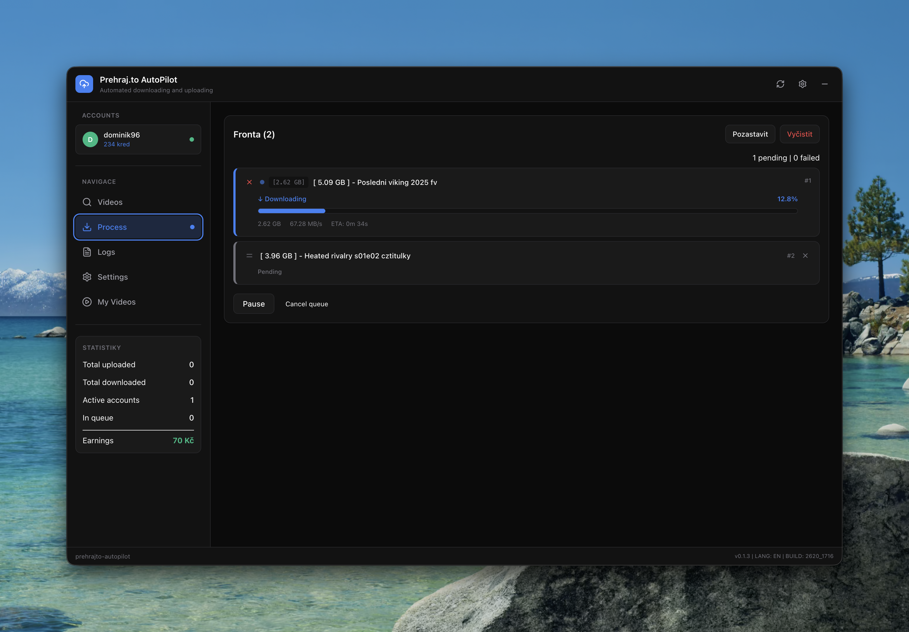
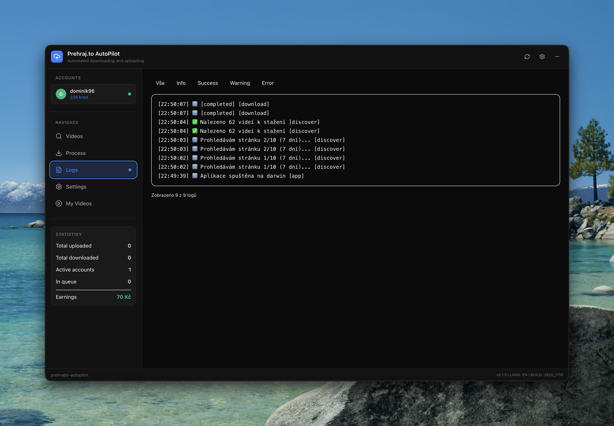
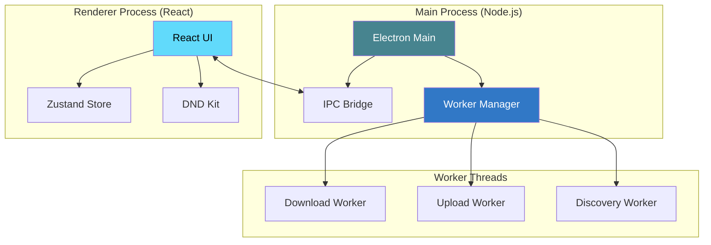

# Prehrajto.cz AutoPilot

<div align="center">

<!-- Badges Row -->
[](https://electronjs.org)
[](https://typescriptlang.org)
[](https://reactjs.org)
[](LICENSE)

[**English**](README.md) • [**Česky**](README.cs.md)

<br>

```text
     ____           _                _ _               
    |  _ \ _ __ ___| |__  _ __ __ _ (_) |_ ___    ___ ____
    | |_) | '__/ _ \ '_ \| '__/ _` || | __/ _ \  / __|_  /
    |  __/| | |  __/ | | | | | (_| || | || (_) || (__ / / 
    |_|   |_|  \___|_| |_|_|  \__,_|/ |\__\___(_) \___/___|
                                  |__/                     
```

### 🚀 Advanced Desktop Automation for Prehrajto.cz

**Efficiently manage, process, and automate your video workflow.**

[**Features**](#-key-features) • [**Architecture**](#-architecture) • [**Tech Stack**](#-tech-stack) • [**Setup**](#-getting-started) • [**Building**](#-production-builds)

---

</div>

## 📸 Visual Overview

<div align="center">

| Video Discovery | Queue Management |
| :---: | :---: |
|  |  |
| *Browse and select videos to download* | *Drag & drop reordering with real-time progress* |

| Download Progress | My Videos Dashboard |
| :---: | :---: |
|  |  |
| *Live speed, ETA, and phase tracking* | *Manage your uploaded videos* |

</div>

---

<details>
<summary><strong>🚧 Features - Work in Progress</strong> (click to expand)</summary>

### Completed ✓
- [x] Auto-Skip Processed Videos
- [x] Fixed 401 Error (HTML entity decoding)

### In Progress 🔄
- [ ] **Parallel Downloading + Uploading** - Simultaneously download and upload videos
- [ ] **Process Tab Redesign** - Completely redesigned workflow and UX
- [ ] **Settings Tab Redesign** - Better organization and fixes
- [ ] **User Statistics** - Track history, data usage, and activity
- [ ] **Edit Videos from App** - Modify names and descriptions directly

</details>

---

## 📖 Project Overview

**Prehrajto.cz AutoPilot** is a sophisticated desktop application designed to streamline video management for the **Prehrajto.cz** platform. Built on the modern **Electron + React** stack, it offers a robust, cross-platform solution for high-performance video discovery, automated downloading, professional watermarking, and seamless uploading.

Designed with security and performance in mind, the application runs entirely locally, protecting your credentials while leveraging background worker threads to ensure a buttery-smooth UI experience even under heavy load.

---

## ✨ Key Features

### 🔐 Account & Security
- **Multi-Account Support**: Manage multiple Prehrajto.cz profiles simultaneously.
- **Secure Storage**: Encrypted credential handling with persistent session management.
- **Auto-Login**: Seamless background authentication using Playwright-powered session refresh.

### ⚡ Smart Queue Engine
- **Intuitive Drag & Drop**: Effortlessly prioritize your tasks with `@dnd-kit`.
- **Live Telemetry**: Real-time monitoring of download speeds, ETA, and progress percentages.
- **Fail-Safe Operations**: One-click retries for failed tasks and instant cancellation support.
- **Persistence**: Your queue and progress are automatically saved between sessions.

### 🔍 Automated Discovery
- **Deep Scanning**: Automatically find and index videos directly from Prehrajto.cz.
- **Smart Filters**: Filter content by duration, file size, and quality.
- **Batch Processing**: Select and add hundreds of videos to your queue with a single click.

### 🛠️ High-Performance Processing
- **Parallel Chunking**: Reliable 2MB chunked downloads to maximize speed and stability.
- **Professional Watermarking**: Integrated FFmpeg support for automated brand overlays.
- **Multi-Engine Support**: Choose between `ffmpeg-chunks`, `curl`, or `wget` for optimal reliability.
- **HQ Processing**: Toggle between original quality (HQ) and optimized direct streams.

---

## 🏗️ System Architecture

The application follows a modern multi-process architecture to ensure maximum reliability and performance.



---

## 🛠️ Technology Stack

| Component | Technology | Role |
| :--- | :--- | :--- |
| **Runtime** | **Electron 39.2** | Cross-platform container |
| **Frontend** | **React 19 + TypeScript** | Modern, type-safe UI layer |
| **Styling** | **TailwindCSS 4** | Utility-first responsive design |
| **State** | **Zustand** | Performant, persistent state management |
| **Automation** | **Playwright** | Browser-level session handling |
| **Processing** | **FFmpeg** | Advanced video manipulation |
| **Concurrency** | **Worker Threads** | Non-blocking background operations |

---

## 🚀 Getting Started

### Prerequisites
- **Node.js** (LTS version recommended)
- **FFmpeg** installed and available in your system PATH
- **Package Manager**: `npm` or `pnpm`

### Installation
```bash
# Clone the repository
git clone https://github.com/nykadamec/preHrajto-AutoPilot.git
cd preHrajto-AutoPilot

# Install dependencies
npm install

# Start in development mode
npm run dev
```

### Environment Configuration
| Tool | Purpose | Recommended Install |
| :--- | :--- | :--- |
| **FFmpeg** | Watermarking & Processing | `brew install ffmpeg` / `choco install ffmpeg` |
| **curl/wget** | Alternative Transfer Modes | Pre-installed or via system package manager |

---

## 📦 Production Builds

Generate optimized binaries for your specific platform:

```bash
# Build for your current OS
npm run build

# Targeted platform builds
npm run build:mac   # macOS (Apple Silicon)
npm run build:win   # Windows (x64)
npm run build:linux # Linux
```

Artifacts will be available in the `release/` directory.

---

## 📄 License

This project is licensed under the **ISC License**. See the [LICENSE](LICENSE) file for more information.

---

## 📋 Changelog

### [v0.1.4] - 2026-01-21

#### ✨ New Features
- **Auto-Skip Processed Videos**: Discovery now automatically skips already processed videos and continues to next pages to reach the target count
- **Streamlined UI**: Removed "Již zpracovaná" (Processed) section - processed videos are now filtered during discovery for a cleaner experience

#### 🐛 Bug Fixes
- **Fixed 401 Error**: Resolved video download failures caused by improperly decoded URLs (HTML entities like `&amp;` now correctly converted to `&`)

---

<div align="center">

**Developed with ❤️ for the Prehrajto.cz Community**

</div>