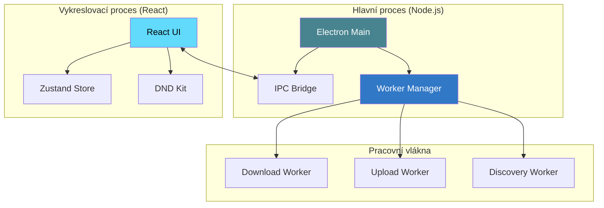

# Prehrajto.cz AutoPilot

<div align="center">

<!-- Badges Row -->
[](https://electronjs.org)
[](https://typescriptlang.org)
[](https://reactjs.org)
[](LICENSE)

<br>

```text
     ____           _                _ _               
    |  _ \ _ __ ___| |__  _ __ __ _ (_) |_ ___    ___ ____
    | |_) | '__/ _ \ '_ \| '__/ _` || | __/ _ \  / __|_  /
    |  __/| | |  __/ | | | | | (_| || | || (_) || (__ / / 
    |_|   |_|  \___|_| |_|_|  \__,_|/ |\__\___(_) \___/___|
                                  |__/                     
```

### 🚀 Pokročilá desktopová automatizace pro Prehrajto.cz

**Efektivně spravujte, zpracovávejte a automatizujte své video workflow.**

[**Funkce**](#-klíčové-funkce) • [**Architektura**](#-architektura) • [**Technologie**](#-použité-technologie) • [**Instalace**](#-začínáme) • [**Sestavení**](#-produkční-sestavení)

---

</div>

## 📸 Vizuální přehled

<div align="center">

| Objevování videí | Správa fronty |
| :---: | :---: |
|  |  |
| *Prohlížejte a vybírejte videa ke stažení* | *Změna pořadí tažením s náhledem v reálném čase* |

| Průběh stahování | Moje Videa |
| :---: | :---: |
|  |  |
| *Aktuální rychlost, zbývající čas a stav* | *Správa vašich nahraných videí* |

</div>

---

## 📖 Přehled projektu

**Prehrajto.cz AutoPilot** je sofistikovaná desktopová aplikace navržená pro zefektivnění správy videí na platformě **Prehrajto.cz**. Postavená na moderním stacku **Electron + React**, nabízí robustní multiplatformní řešení pro vysokorychlostní vyhledávání videí, automatizované stahování, profesionální vkládání vodoznaků a bezproblémové nahrávání.

Aplikace je navržena s důrazem na bezpečnost a výkon – běží zcela lokálně, chrání vaše přihlašovací údaje a využívá pracovní vlákna (worker threads) na pozadí, aby zajistila plynulé uživatelské rozhraní i při vysokém vytížení.

---

## ✨ Klíčové funkce

### 🔐 Účty a bezpečnost
- **Podpora více účtů**: Spravujte několik profilů Prehrajto.cz současně.
- **Bezpečné úložiště**: Šifrované nakládání s údaji a perzistentní správa relací.
- **Automatické přihlášení**: Plynulá autentizace na pozadí s automatickou obnovou tokenů (pomocí Playwright).

### ⚡ Inteligentní fronta
- **Intuitivní Drag & Drop**: Snadno měňte prioritu úloh díky `@dnd-kit`.
- **Telemetrie v reálném čase**: Sledujte rychlost stahování, ETA a procenta dokončení.
- **Odolnost proti chybám**: Opakování neúspěšných úloh na jedno kliknutí a podpora okamžitého zrušení.
- **Perzistence**: Vaše fronta a pokrok se automaticky ukládají mezi restarty aplikace.

### 🔍 Automatizované vyhledávání
- **Hloubkové skenování**: Automaticky vyhledává a indexuje videa přímo z Prehrajto.cz.
- **Chytré filtry**: Filtrujte obsah podle délky, velikosti souboru a kvality.
- **Dávkové zpracování**: Vyberte a přidejte stovky videí do fronty jediným kliknutím.

### 🛠️ Vysoký výkon zpracování
- **Paralelní segmenty**: Spolehlivé stahování po 2MB částech pro maximální stabilitu a rychlost.
- **Profesionální vodoznaky**: Integrovaná podpora FFmpeg pro automatické vkládání loga.
- **Více režimů přenosu**: Možnost volby mezi `ffmpeg-chunks`, `curl` nebo `wget` pro optimální spolehlivost.
- **HQ Zpracování**: Přepínání mezi originální kvalitou (HQ) a optimalizovanými přímými streamy.

---

## 🏗️ Architektura systému

Aplikace využívá moderní víceprocesovou architekturu pro zajištění maximální spolehlivosti.



---

## 🛠️ Použité technologie

| Komponenta | Technologie | Role |
| :--- | :--- | :--- |
| **Runtime** | **Electron 39.2** | Multiplatformní kontejner |
| **Frontend** | **React 19 + TypeScript** | Moderní, typově bezpečné UI |
| **Styling** | **TailwindCSS 4** | Utility-first responzivní design |
| **Stav** | **Zustand** | Výkonná a perzistentní správa stavu |
| **Automatizace** | **Playwright** | Správa relací na úrovni prohlížeče |
| **Zpracování** | **FFmpeg** | Pokročilá manipulace s videem |
| **Konkurence** | **Worker Threads** | Neblokující operace na pozadí |

---

## 🚀 Začínáme

### Požadavky
- **Node.js** (doporučena LTS verze)
- **FFmpeg** nainstalovaný a dostupný v PATH systému
- **Package Manager**: `npm` nebo `pnpm`

### Instalace
```bash
# Klonování repozitáře
git clone https://github.com/nykadamec/preHrajto-AutoPilot.git
cd preHrajto-AutoPilot

# Instalace závislostí
npm install

# Spuštění ve vývojovém režimu
npm run dev
```

---

## 📦 Produkční sestavení

Generování optimalizovaných binárních souborů pro vaši platformu:

```bash
# Sestavení pro aktuální OS
npm run build

# Cílené sestavení
npm run build:mac   # macOS (Apple Silicon)
npm run build:win   # Windows (x64)
npm run build:linux # Linux
```

Výstupy naleznete v adresáři `release/`.

---

## 📄 Licence

Tento projekt je licencován pod **ISC Licencí**. Více informací naleznete v souboru [LICENSE](LICENSE).

---

<div align="center">

**Vyvinuto s ❤️ pro komunitu Prehrajto.cz**

</div>